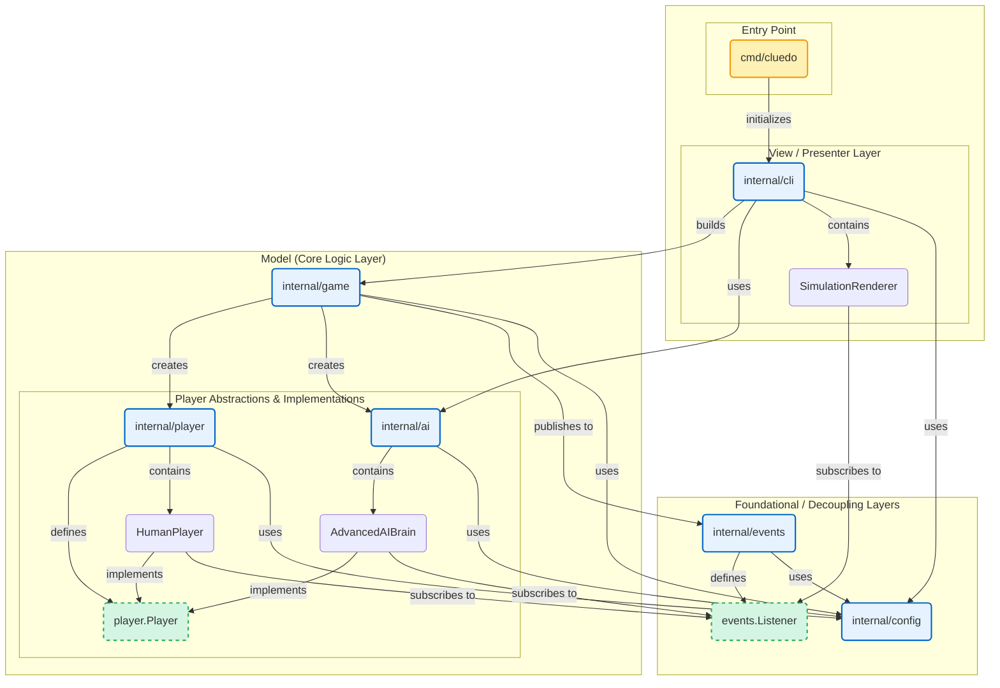

# Cluedo Toolbox
A Master-Level AI Assistant and Game Simulator for the classic board game Cluedo (Clue).

[](https://goreportcard.com/report/github.com/your-username/cluedo-toolbox)

This command-line application provides a powerful toolbox for Cluedo enthusiasts. It features a sophisticated AI deduction engine capable of solving game mysteries with master-level efficiency. The application can run full game simulations or act as an interactive "co-pilot" to assist a human player during a real-life game.

## Core Features

-   **Advanced AI Deduction Engine:** Utilizes a constraint-satisfaction model to track cards, manage uncertainty, and make logical deductions from game events.
-   **Simulation Mode:** Run a full, fast-paced game simulation between any combination of human and AI players to test strategies or watch the AI work.
-   **Detective Mode:** An interactive co-pilot that assists a human player. Log events from your physical board game, and the AI will track all known information and provide strategic suggestions on demand.
-   **Pluggable AI Strategies:** The AI's decision-making is built on the Strategy pattern, allowing it to dynamically choose between exploring for new information, exploiting known facts, or performing a "surgical strike" to solve a key mystery.
-   **Clean & Readable Interface:** A color-coded command-line interface with formatted tables makes tracking the game state intuitive and clear.

## Demo: Detective Mode Notes

The AI maintains a detailed detective notebook, updating it with every new piece of information.

  <!-- It's highly recommended to take a real screenshot and replace this link -->

```
╭───────────────────────────────────────────────────────────────────────────────────────────╮
│ Colonel Mustard's Detective Notes                                                         │
├────┬─────────────────┬──────────┬─────────────────┬──────────────┬─────────────┬──────────┤
│ ID │ CARD            │ TYPE     │ COLONEL MUSTARD │ MRS. PEACOCK │ MISS SCARLE…│ SOLUTION │
├────┼─────────────────┼──────────┼─────────────────┼──────────────┼─────────────┼──────────┤
│ 2 │ Colonel Mustard  │ suspects │        ✖        │       ✖      │      ✖      │    ✔     │
│ 1 │ Miss Scarlett │ suspects │ ✖ │ ✔ │ ✖ │ ✖ │
│ 5 │ Mrs. Peacock │ suspects │ ✔ │ ✖ │ ✖ │ ✖ │
│ ...│ ... │ ... │ ... │ ... │ ... │ ... │
├────┼─────────────────┼──────────┼─────────────────┼──────────────┼─────────────┼──────────┤
│ 11 │ Rope │ weapons │ ✖ │ ✖ │ ✔ │ ✖ │
│ 12 │ Wrench │ weapons │ ✖ │ ✔ │ ✖ │ ✖ │
│ ...│ ... │ ... │ ... │ ... │ ... │ ... │
├────┼─────────────────┼──────────┼─────────────────┼──────────────┼─────────────┼──────────┤
│ 16 │ Dining Room │ rooms │ ✖ │ ✖ │ ✖ │ ✔ │
│ ...│ ... │ ... │ ... │ ... │ ... │ ... │
╰────┴─────────────────┴──────────┴─────────────────┴───────────────┴─────────────┴──────────╯
```

## Installation

To install the application directly, ensure you have Go installed (version 1.18 or higher) and run:

```bash
go install github.com/beachviking/cluedo-toolbox/cmd/cluedo@latest
```

This will install the cluedo binary in your Go bin directory.

## Usage
The application has two primary modes.

## 1. Simulation Mode
Run a complete game simulation from the command line.
Command:
```bash
cluedo start <num_humans> <num_ai>
```

Example: To start a game with 3 AI players:
```bash
cluedo start 0 3
```

Flags:
-loglevel debug: Use this flag to see the AI's detailed thought process, including strategy selection and deduction steps.

## 2. Detective Mode
Run the AI as an interactive assistant for a physical game.
Command:
```bash
cluedo detective
```

The application will guide you through a setup wizard to configure the players and your hand of cards.

Detective Mode Commands
| Command |	Alias |	Description |
| ------- |	----- |	----------- |
| log	  |   l	  | Log a full game turn (suggestion and result). |
| reveal | r | 	Log a single card revealed by a player. |
| suggest	| s | 	Ask the AI co-pilot for a strategic suggestion. | 
| notes	| n | 	Display the AI's current detective notes grid. | 
| hand	| ha | 	Display the cards currently in your hand. | 
| help	| h | 	Show this help message. | 
| quit	| q | 	Exit detective mode. | 

## For Developers
This project is structured as a modern Go application, prioritizing separation of concerns and testability.

## Project Structure
The project follows a standard Go layout to enforce architectural boundaries.

```
.
├── cmd/cluedo/main.go      # Main application entry point and dependency injection.
├── internal/
│   ├── ai/                 # The AI brain and all decision-making strategies.
│   ├── cli/                # All command-line UI, rendering, and prompts.
│   ├── config/             # Configuration loading and data structures.
│   ├── events/             # The event bus (Observer pattern) for decoupling.
│   ├── game/               # The core game engine, rules, and game builder.
│   └── player/             # The Player interface and HumanPlayer implementation.
├── go.mod                  # Go module definition.
└── default_config.json     # The default card set for the game.
```

## Architectural Patterns
The architecture relies on several key design patterns to ensure the code is robust, decoupled, and extensible.
- Model-View-Presenter (MVP): The core application logic (game, ai, player - the Model) is completely independent of the user interface (cli - the View/Presenter). This separation is the cornerstone of the architecture.
- Observer Pattern (Event Bus): The game engine is "headless" and communicates state changes via the events package. This decouples the Model from the View and prevents forbidden import cycles.
- Dependency Injection: Dependencies like the logger (logrus) and random number source (rand.Rand) are passed into components, making them highly testable.
- Strategy Pattern: The AI's suggestion logic is built on strategies (Explore, Exploit, SurgicalStrike), making it easy to add or modify its decision-making process without changing the AI's core.
- Builder Pattern: The GameBuilder provides a clean, step-by-step API for constructing and initializing a valid Game object.

# Mermaid diagram of solution


## Building from Source
```bash
go build -o cluedo ./cmd/cluedo
```

## Running Tests
The project is structured for easy unit testing. All core logic in the internal/ai and internal/game packages has accompanying unit tests.
To run all tests:
```bash
go test -v ./...
```

## Configuration
The game's card set is defined in default_config.json. You can modify this file to play with different versions of Cluedo or your own house rules.
```json
{
  "suspects": [
    "Miss Scarlett",
    "Colonel Mustard",
    "Mrs. White",
    "Mr. Green",
    "Mrs. Peacock",
    "Professor Plum"
  ],
  "weapons": [
    "Candlestick",
    "Dagger",
    "Lead Pipe",
    "Revolver",
    "Rope",
    "Wrench"
  ],
  "rooms": [
    "Kitchen",
    "Ballroom",
    "Conservatory",
    "Dining Room",
    "Billiard Room",
    "Library",
    "Lounge",
    "Hall",
    "Study"
  ]
}
```

## License
Distributed under the MIT License. See LICENSE for more information.